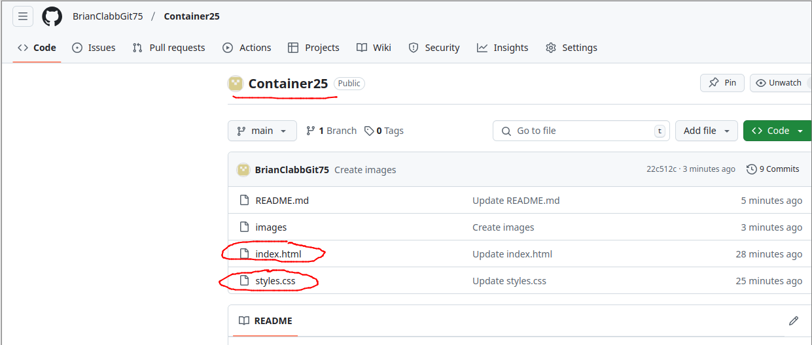
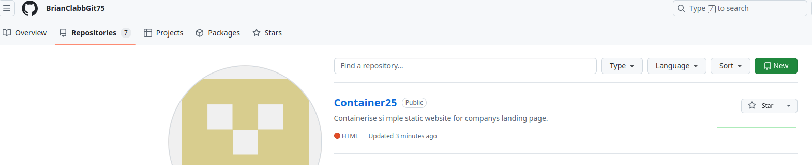

# Container25

Containerise simple static website for company's landing page.


**Project**


In this project i will be creating a static website (HTML & CSS) for a company's landing page. The fictional company is called Container25. The aim of this project is to containerise the application user Docker, deploy it to a Kubernetes cluster, and access it through Nginx. 

<ins>Task1 Setup Project</ins>

I have created my repository in GitHub-Container25-with the html and css file included.



<ins>Task2 Initialise Git</ins>

You can see that I have my Container25 repository for this project now initialised.





<ins>Task3 Git Commit</ins>

index.html and style.css have been created-and committed to Git Repo -  Please see screenshot 1. 
Here is the code for index.html

```<!DOCTYPE html>
<html>
<head>
  <title>Container25</title>
  <link rel="stylesheet" href="styles.css">
</head>
<body>

  <header>
    <h1>Container25</h1>
    <nav>
      <ul>
        <li><a href="#">Home</a></li>
        <li><a href="#">About</a></li>
        <li><a href="#">Services</a></li>
        <li><a href="#">Contact</a></li>
      </ul>
    </nav>
  </header>

  <main>
    <section>
      <h2>Welcome to Container25</h2>
      <p>We are a leading provider of innovative container solutions.</p>
    </section>
  </main>

  <footer>
    <p>&copy; 2023 Container25</p>
  </footer>

</body>
</html>
```


Here is the code for style.css:
```body {
  font-family: sans-serif;
  margin: 0;
}

header {
  background-color: #333;
  color: #fff;
  padding: 1rem;
}

nav ul {
  list-style: none;
  margin: 0;
  padding: 0;
}

nav li {
  display: inline;
  margin-right: 1rem;
}

nav a {
  color: #fff;
  text-decoration: none;
}

main {
  padding: 2rem;
}

footer {
  background-color: #333;
  color: #fff;
  text-align: center;
  padding: 1rem;
}
```
the index.html has splash screen for the webpage, including Categories:
* Home
* About
* Services
* Contact

The style.css dictates the alignment,colours, borders and backgrounds etc.

<ins>Task4 Dockerize the Application</ins>

We will now create a Dockerfile specifying Nginx as the base image.
